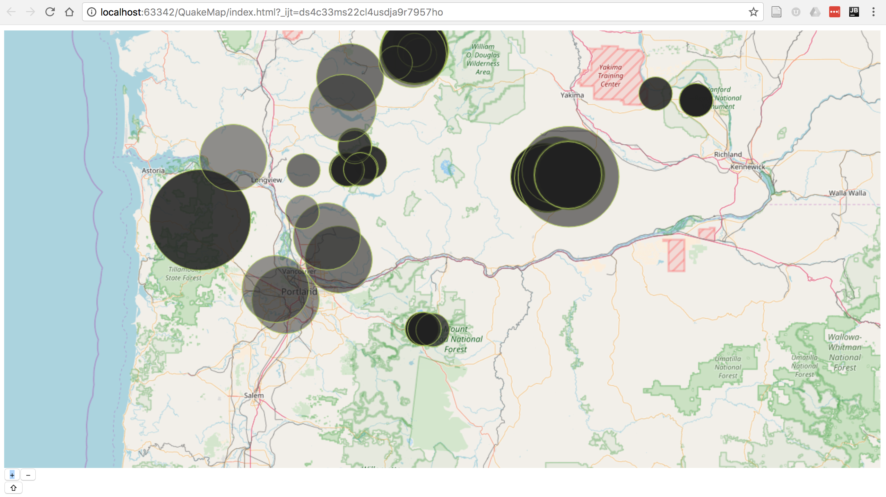
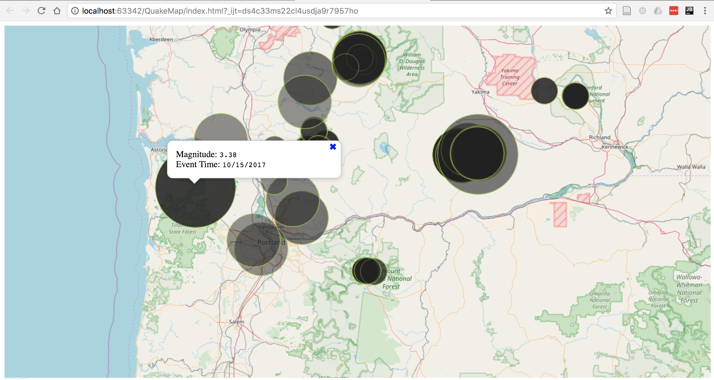

# Earthquake Mapping

This web app uses the [USGS earthquake API](http://earthquake.usgs.gov/earthquakes/feed/v1.0/summary/all_week.geojson) to gather and plot earthquake
observations for the last week using [OpenLayers](https://openlayers.org/).

* The size of each dot corresponds to the strength of the earthquake
* More recent earthquakes are more opaque
* Clicking on a given dot displays the earthquake's magnitude and the
time of the event

## Screenshot of the Web Map

